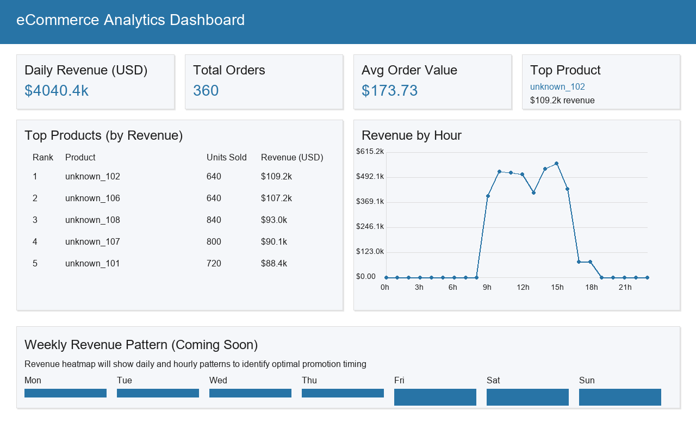

# Dashboard Mockup

This mockup outlines an analytics dashboard to answer the business questions about product performance and optimal sales timing. A visual mockup is provided below, followed by implementation notes for a BI tool (Tableau, PowerBI, or Looker).



## Dashboard Structure

### Top row: KPIs
- Daily Revenue (USD) - Total revenue for the selected day
- Total Orders - Number of transactions processed
- Average Order Value - Revenue per order (indicates purchase size)
- Top Product - Highest revenue product with its total revenue

## Main Visualizations

### 1. Top Products Table
- **Purpose**: Identify best-performing products by revenue
- **Columns**: 
  - Rank (#1-5)
  - Product Name
  - Units Sold (volume)
  - Revenue in USD (sorted descending)
- **Interactivity**: Click product to filter other visuals

### 2. Revenue by Hour Chart
- **Purpose**: Show hourly revenue distribution for promotion timing
- **X-axis**: Hours (8:00-19:00 shown, expandable to 24h)
- **Y-axis**: Revenue in USD with gridlines
- **Features**:
  - Bar height shows revenue
  - Hover tooltips with exact values
  - Clear hour labels and currency formatting

### 3. Revenue Heatmap (Day vs Hour)
- **Purpose**: Identify optimal promotion times across week
- **Structure**:
  - Rows: Days of week (Mon-Sun)
  - Columns: Hours (00-23)
  - Cell color: Revenue intensity
- **Usage**: Dark cells indicate prime promotion windows

## Mockup (ASCII/Markdown layout)

----------------------------+------------------------------
| KPIs: Revenue | Orders | AOV | Top Product              |
|  $12,345      |  1,234 | $10 | SuperWidget (30% rev)   |
----------------------------+------------------------------

Top Products                | Revenue by Hour
--------------------------- | ---------------------------
# | Product     | Qty | Rev | Hour | Revenue (USD)
1 | SuperWidget | 120 | 5,000| 0    | 200
2 | MegaPack    | 100 | 4,000| 1    | 180
3 | BasicThing  | 80  | 3,345| ...  | ...

Heatmap (Day vs Hour)
Mon | [ ., ., .,  12, 45, 90, ... ]
Tue | [ ..., ... ]
...

## Implementation Notes

### Data Access
The dashboard uses pre-aggregated tables for performance:

```sql
-- Top Products by Revenue (with product details)
SELECT p.name, 
       agg.total_quantity as units_sold,
       agg.total_revenue_usd as revenue
FROM agg_product_performance agg
JOIN dim_product p ON p.product_id = agg.product_id
ORDER BY revenue DESC
LIMIT 5;

-- Revenue by Hour (filterable by date range)
SELECT order_hour,
       total_revenue_usd as revenue
FROM agg_hourly_performance
ORDER BY order_hour;
```

### Refresh Strategy
- KPIs and Top Products: Refresh every 15 minutes
- Hourly charts: Update at end of each hour
- Historical heatmap: Daily refresh during off-peak

### Interactive Features
- Date range selector (affects all visuals)
- Product filters from Top Products table
- Hover tooltips on charts
- Optional: Export to CSV/Excel

*This mockup combines clean visualization with performant data access via our pre-aggregated warehouse tables.*